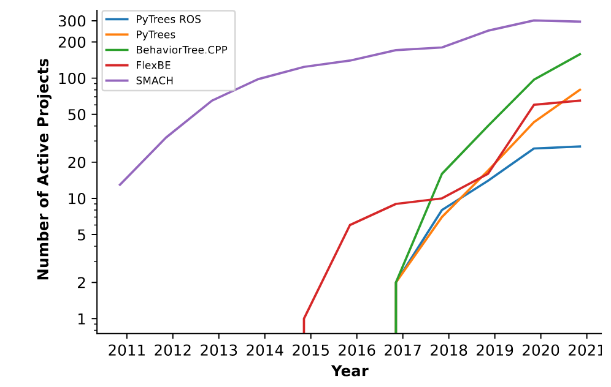

Sometimes people ask me if, when I started this project 4 years ago,
I expected **BehaviorTree.CPP** to gain so much adoption in the robotic community.
Even if that is generally meant as a rhetorical question that expects and humble answer,
I usually answer "yes". 

There are a few reasons why I was optimistic about the fact that this
library might be well received:

- It helps implement a crucial component of a robotic software system,
Task Planning; this part is often neglected until the end of the project.

- I spent an unusual amount of time (maybe 30% of my whole development time)
writing documentation.

- I wanted to build an inclusive project, where people's needs and opinions are heard.
I am the "benevolent dictator" of the project, but I **do** listen and I **do** learn from others!

## Adoption in recent years, 

**BT.CPP** is gaining traction in robotics, as shown in the image
below (note as the Y-axis is logarithmic):

This data was obtained from the paper:

 [Behavior Trees and State Machines in Robotics Applications](https://arxiv.org/abs/2208.04211)

SMACH is still the strongest contender,
but you can also note as **BT.CPP** and **PyTrees** 
have gained more and more popularity in our community.

If you want to learn more about the 
methodology used to obtain these numbers, 
please refer to the publication mentioned above.

## Documentation is a super power

You might be familiar with the phrase:

>"[If a tree falls in a forest](https://en.wikipedia.org/wiki/If_a_tree_falls_in_a_forest)
and no one is around to hear it, does it make a sound?"

My personal version of it is:

> If an open source software is not used by anyone else but the author, is it still useful?

In both cases, we know that the answer is (or might be) **"yes"**, but hopefully you see what I mean.

Very often, open source is about "scratching your own hitch" and sharing what you did with others. That is fine!

But in my case, This project was created **specifically to help others**; the more it is adopted and used, the more
I feel that my initial goal has been achieved.

In my career, I have learned that the best way to drive adoption is:

- built something that people need.
- build trust with your users.
- lower as much as possible the entry barrier.

The latter point is particularly important and it is often underestimated. 
For me, lowering the entry barrier involved three key steps:

- writing good documentation (this website).
- adding tutorials that give the new users a sense of progression.
- providing a tool that helps people learn visually (Groot).

The documentation of **BT.CPP** is not perfect, but probably a little above the average,
considering the average open source project: this cost a lot of time, but paid off enormously.

If you have any suggestions about how to improve this site, 
[let me know](https://github.com/BehaviorTree/btcpp_website/issues).