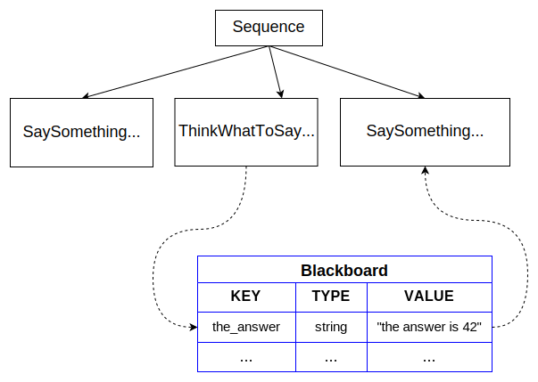

# Blackboard and ports

As we explained earlier, custom TreeNodes can be used to execute an arbitrarily
simple or complex piece of software. Their goal is to provide an interface
with a __higher level of abstraction__.

For this reason, they are not conceptually different from __functions__.

Similar to functions, we often want to:

 - pass arguments/parameters to a Node (__inputs__)
 - get some kind of information out from a Node (__outputs__).
 - The outputs of a Node can be the inputs of another node. 

BehaviorTree.CPP provides a basic mechanism of __dataflow__
through __ports__, that is simple to use but also flexible and type-safe.

In this tutorial, we will create the following tree:



:::tip Main Concepts
- A "Blackboard" is a simple __key/value storage__ shared by all the nodes
of the Tree. 
- An "entry" of the Blackboard is a __key/value pair__.
- __Input ports__ can read an entry in the Blackboard, whilst an __Output port__
can write into an entry.
:::

## Inputs ports

A valid Input can be either:

- a __static string__ that the Node will read and parse, or
- a "pointer" to an entry of the Blackboard, identified by a __key__.

Let's suppose that we want to create an ActionNode called `SaySomething`, 
that should print a given string on `std::cout`.

To pass this string, we will use an input port called __message__.

Consider these alternative XML syntaxes:

``` xml
<SaySomething name="fist"   message="hello world" />
<SaySomething name="second" message="{greetings}" />
```

- In the __first__ node, the port receives the string "hello world";
- The __second__ node, instead, is asked to find the value in the blackboard,
using the entry "greetings".

:::caution
The value of the entry "greetings" can (and probably will) change at run-time.
:::

The ActionNode `SaySomething` can be implemented as follows:

``` cpp
// SyncActionNode (synchronous action) with an input port.
class SaySomething : public SyncActionNode
{
public:
  // If your Node has ports, you must use this constructor signature 
  SaySomething(const std::string& name, const NodeConfig& config)
    : SyncActionNode(name, config)
  { }

  // It is mandatory to define this STATIC method.
  static PortsList providedPorts()
  {
    // This action has a single input port called "message"
    return { InputPort<std::string>("message") };
  }

  // Override the virtual function tick()
  NodeStatus tick() override
  {
    Expected<std::string> msg = getInput<std::string>("message");
    // Check if optional is valid. If not, throw its error
    if (!msg)
    {
      throw BT::RuntimeError("missing required input [message]: ", 
                              msg.error() );
    }
    // use the method value() to extract the valid message.
    std::cout << "Robot says: " << msg.value() << std::endl;
    return NodeStatus::SUCCESS;
  }
};
```

When a custom TreeNode has input and/or output ports, these ports must be 
declared in the __static__ method:

``` cpp
static MyCustomNode::PortsList providedPorts();
```

The input from the port `message` can be read using the template method 
`TreeNode::getInput<T>(key)`.

This method may fail for multiple reasons. It is up to the user to
check the validity of the returned value and to decide what to do:

- Return `NodeStatus::FAILURE`?
- Throw an exception?
- Use a different default value?

:::caution Important
It is __always__ recommended to call the method `getInput()` inside the 
`tick()`, and __not__ in the constructor of the class.
     
The C++ code should expect the actual value of the input
to __change at run-time__, for this reason it should be updated 
periodically. 
:::

## Output ports

An input port pointing to the entry of the blackboard will be valid only
if another node has already written "something" inside that same entry.

`ThinkWhatToSay` is an example of Node that uses an __output port__ to write a 
string into an entry.

``` cpp
class ThinkWhatToSay : public SyncActionNode
{
public:
  ThinkWhatToSay(const std::string& name, const NodeConfig& config)
    : SyncActionNode(name, config)
  { }

  static PortsList providedPorts()
  {
    return { OutputPort<std::string>("text") };
  }

  // This Action writes a value into the port "text"
  NodeStatus tick() override
  {
    // the output may change at each tick(). Here we keep it simple.
    setOutput("text", "The answer is 42" );
    return NodeStatus::SUCCESS;
  }
};
```

Alternatively, most of the time for debugging purposes, it is possible to write a
static value into an entry using the built-in Actions called `Script`.

``` xml
<Script code=" the_answer:='The answer is 42' " />
```

We will talk more about the Action __Script__ in the tutorial
about the [new scripting language inside BT.CPP](tutorial-advanced/scripting.md)

:::tip
If you are migrating from BT.CPP 3.X, __Script__ is a drop-in replacement
for __SetBlackboard__, which is now discouraged.
:::

## A complete example

In this example, a Sequence of 3 Actions is executed:

- Action 1 reads the input `message` from a static string.

- Action 2 writes something into the entry of the blackboard called `the_answer`.

- Action 3 read the input `message` from an entry in the blackboard called `the_answer`.

``` xml
<root BTCPP_format="4" >
    <BehaviorTree ID="MainTree">
       <Sequence name="root_sequence">
           <SaySomething     message="hello" />
           <ThinkWhatToSay   text="{the_answer}"/>
           <SaySomething     message="{the_answer}" />
       </Sequence>
    </BehaviorTree>
</root>
```

The C++ code to register and execute the tree:

``` cpp
#include "behaviortree_cpp/bt_factory.h"

// file that contains the custom nodes definitions
#include "dummy_nodes.h"
using namespace DummyNodes;

int main()
{  
  BehaviorTreeFactory factory;
  factory.registerNodeType<SaySomething>("SaySomething");
  factory.registerNodeType<ThinkWhatToSay>("ThinkWhatToSay");

  auto tree = factory.createTreeFromFile("./my_tree.xml");
  tree.tickWhileRunning();
  return 0;
}

/*  Expected output:
  Robot says: hello
  Robot says: The answer is 42
*/
```

We "connect" output ports to input ports using the same key (`the_answer`);
in other words, they "point" to the same entry of the blackboard.

These ports can be connected to each other because their type is the same,
i.e. `std::string`. if you try to connect ports with different types, 
the method `factory.createTreeFromFile` will throw an exception.


